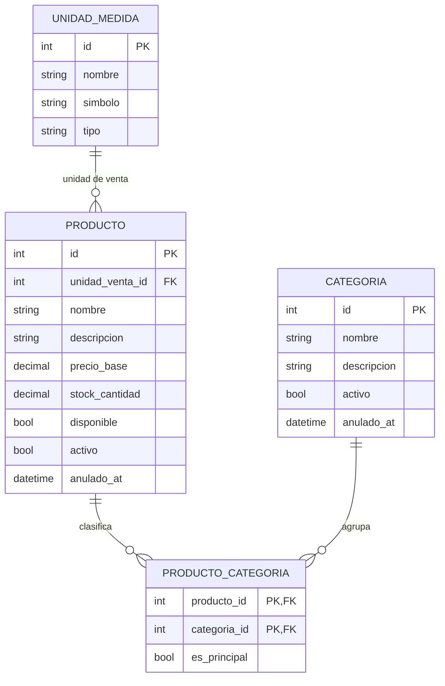

```mermaid
erDiagram
UNIDAD_MEDIDA {
int id PK
string nombre
string simbolo
string tipo
}
CATEGORIA {
int id PK
string nombre
string descripcion
bool activo
datetime anulado_at
}
PRODUCTO {
int id PK
int unidad_venta_id FK
string nombre
string descripcion
decimal precio_base
decimal stock_cantidad
bool disponible
bool activo
datetime anulado_at
}
PRODUCTO_CATEGORIA {
int producto_id PK,FK
int categoria_id PK,FK
bool es_principal
}
UNIDAD_MEDIDA ||--o{ PRODUCTO : "unidad de venta"
PRODUCTO ||--o{ PRODUCTO_CATEGORIA : "clasifica"
CATEGORIA ||--o{ PRODUCTO_CATEGORIA : "agrupa"
```